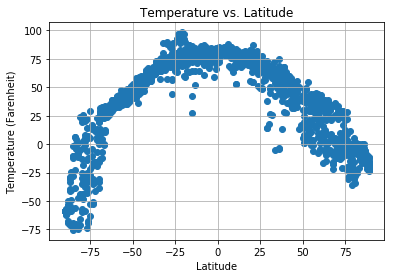
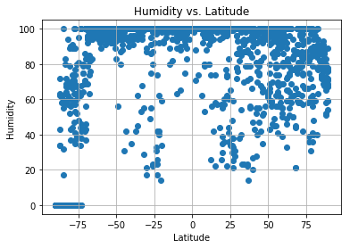
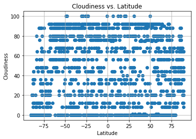
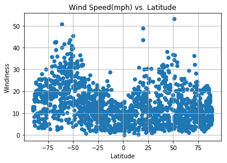

## Unit 6 | Assignment - What's the Weather Like?

## Background

Whether financial, political, or social -- data's true power lies in its ability to answer questions definitively. So let's take what you've learned about Python requests, APIs, and JSON traversals to answer a fundamental question: "What's the weather like as we approach the equator?"

Now, we know what you may be thinking: _"Duh. It gets hotter..."_ 

But, if pressed, how would you **prove** it? 


## WeatherPy

In this example, you'll be creating a Python script to visualize the weather of 500+ cities across the world of varying distance from the equator. To accomplish this, you'll be utilizing a [simple Python library](https://pypi.python.org/pypi/citipy), the [OpenWeatherMap API](https://openweathermap.org/api), and a little common sense to create a representative model of weather across world cities.

Your objective is to build a series of scatter plots to showcase the following relationships:

* Temperature (F) vs. Latitude
* Humidity (%) vs. Latitude
* Cloudiness (%) vs. Latitude
* Wind Speed (mph) vs. Latitude

Your final notebook must:

* Randomly select **at least** 500 unique (non-repeat) cities based on latitude and longitude.
* Perform a weather check on each of the cities using a series of successive API calls. 
* Include a print log of each city as it's being processed with the city number, city name, and requested URL.
* Save both a CSV of all data retrieved and png images for each scatter plot.

As final considerations:

* You must use the Matplotlib and Seaborn libraries.
* You must include a written description of three observable trends based on the data. 
* You must use proper labeling of your plots, including aspects like: Plot Titles (with date of analysis) and Axes Labels.
* You must include an exported markdown version of your Notebook called  `README.md` in your GitHub repository.  
* See [Example Solution](WeatherPy_Example.pdf) for a reference on expected format. 

## Hints and Considerations

* You may want to start this assignment by refreshing yourself on 4th grade geography, in particular, the [geographic coordinate system](http://desktop.arcgis.com/en/arcmap/10.3/guide-books/map-projections/about-geographic-coordinate-systems.htm). 

* Next, spend the requisite time necessary to study the OpenWeatherMap API. Based on your initial study, you should be able to answer  basic questions about the API: Where do you request the API key? Which Weather API in particular will you need? What URL endpoints does it expect? What JSON structure does it respond with? Before you write a line of code, you should be aiming to have a crystal clear understanding of your intended outcome.

* Though we've never worked with the [citipy Python library](https://pypi.python.org/pypi/citipy), push yourself to decipher how it works, and why it might be relevant. Before you try to incorporate the library into your analysis, start by creating simple test cases outside your main script to confirm that you are using it correctly. Too often, when introduced to a new library, students get bogged down by the most minor of errors -- spending hours investigating their entire code -- when, in fact, a simple and focused test would have shown their basic utilization of the library was wrong from the start. Don't let this be you!

* Part of our expectation in this challenge is that you will use critical thinking skills to understand how and why we're recommending the tools we are. What is Citipy for? Why would you use it in conjunction with the OpenWeatherMap API? How would you do so?

* In building your script, pay attention to the cities you are using in your query pool. Are you getting coverage of the full gamut of latitudes and longitudes? Or are you simply choosing 500 cities concentrated in one region of the world? Even if you were a geographic genius, simply rattling 500 cities based on your human selection would create a biased dataset. Be thinking of how you should counter this. (Hint: Consider the full range of latitudes).

* Lastly, remember -- this is a challenging activity. Push yourself! If you complete this task, then you can safely say that you've gained a strong mastery of the core foundations of data analytics and it will only go better from here. Good luck!


WEATHERPY ANALYSIS AND OBSEDRVATIONS

1) There is no correlation between latitude and Humidity
2) There is no correlation between latitude and Cloudiness
3) There is a very clear correlation between temperature and latitude.


```python
import numpy as np
import pandas as pd
import matplotlib.pyplot as plt
from citipy import citipy
import requests
import time
import json
import config
```


```python
lats=np.random.randint(-90,90, size=1500)
long=np.random.randint(-180, 180, size=1500)
points=pd.DataFrame({"Latitude":lats, "Longitude":long})
points
```


<div>
<style scoped>
    .dataframe tbody tr th:only-of-type {
        vertical-align: middle;
    }

    .dataframe tbody tr th {
        vertical-align: top;
    }

    .dataframe thead th {
        text-align: right;
    }
</style>
<table border="1" class="dataframe">
  <thead>
    <tr style="text-align: right;">
      <th></th>
      <th>Latitude</th>
      <th>Longitude</th>
    </tr>
  </thead>
  <tbody>
    <tr>
      <th>0</th>
      <td>-55</td>
      <td>-61</td>
    </tr>
    <tr>
      <th>1</th>
      <td>82</td>
      <td>-89</td>
    </tr>
    <tr>
      <th>2</th>
      <td>-60</td>
      <td>9</td>
    </tr>
    <tr>
      <th>3</th>
      <td>39</td>
      <td>-141</td>
    </tr>
    <tr>
      <th>4</th>
      <td>25</td>
      <td>-42</td>
    </tr>
    <tr>
      <th>5</th>
      <td>-61</td>
      <td>-145</td>
    </tr>
    <tr>
      <th>6</th>
      <td>-56</td>
      <td>131</td>
    </tr>
    <tr>
      <th>7</th>
      <td>-10</td>
      <td>-19</td>
    </tr>
    <tr>
      <th>8</th>
      <td>25</td>
      <td>-156</td>
    </tr>
    <tr>
      <th>9</th>
      <td>-63</td>
      <td>-6</td>
    </tr>
    <tr>
      <th>10</th>
      <td>58</td>
      <td>145</td>
    </tr>
    <tr>
      <th>11</th>
      <td>67</td>
      <td>-63</td>
    </tr>
    <tr>
      <th>12</th>
      <td>-89</td>
      <td>-43</td>
    </tr>
    <tr>
      <th>13</th>
      <td>-2</td>
      <td>167</td>
    </tr>
    <tr>
      <th>14</th>
      <td>8</td>
      <td>-177</td>
    </tr>
    <tr>
      <th>15</th>
      <td>-23</td>
      <td>174</td>
    </tr>
    <tr>
      <th>16</th>
      <td>24</td>
      <td>-21</td>
    </tr>
    <tr>
      <th>17</th>
      <td>-50</td>
      <td>-9</td>
    </tr>
    <tr>
      <th>18</th>
      <td>-52</td>
      <td>53</td>
    </tr>
    <tr>
      <th>19</th>
      <td>8</td>
      <td>-114</td>
    </tr>
    <tr>
      <th>20</th>
      <td>-20</td>
      <td>142</td>
    </tr>
    <tr>
      <th>21</th>
      <td>40</td>
      <td>-27</td>
    </tr>
    <tr>
      <th>22</th>
      <td>81</td>
      <td>-79</td>
    </tr>
    <tr>
      <th>23</th>
      <td>-43</td>
      <td>-2</td>
    </tr>
    <tr>
      <th>24</th>
      <td>46</td>
      <td>92</td>
    </tr>
    <tr>
      <th>25</th>
      <td>-1</td>
      <td>-54</td>
    </tr>
    <tr>
      <th>26</th>
      <td>72</td>
      <td>-143</td>
    </tr>
    <tr>
      <th>27</th>
      <td>5</td>
      <td>-101</td>
    </tr>
    <tr>
      <th>28</th>
      <td>-80</td>
      <td>-77</td>
    </tr>
    <tr>
      <th>29</th>
      <td>8</td>
      <td>151</td>
    </tr>
    <tr>
      <th>...</th>
      <td>...</td>
      <td>...</td>
    </tr>
    <tr>
      <th>1470</th>
      <td>-85</td>
      <td>58</td>
    </tr>
    <tr>
      <th>1471</th>
      <td>-60</td>
      <td>153</td>
    </tr>
    <tr>
      <th>1472</th>
      <td>9</td>
      <td>-48</td>
    </tr>
    <tr>
      <th>1473</th>
      <td>-69</td>
      <td>21</td>
    </tr>
    <tr>
      <th>1474</th>
      <td>-41</td>
      <td>-149</td>
    </tr>
    <tr>
      <th>1475</th>
      <td>66</td>
      <td>174</td>
    </tr>
    <tr>
      <th>1476</th>
      <td>-6</td>
      <td>-155</td>
    </tr>
    <tr>
      <th>1477</th>
      <td>-20</td>
      <td>96</td>
    </tr>
    <tr>
      <th>1478</th>
      <td>-84</td>
      <td>-79</td>
    </tr>
    <tr>
      <th>1479</th>
      <td>87</td>
      <td>-6</td>
    </tr>
    <tr>
      <th>1480</th>
      <td>-2</td>
      <td>46</td>
    </tr>
    <tr>
      <th>1481</th>
      <td>-72</td>
      <td>26</td>
    </tr>
    <tr>
      <th>1482</th>
      <td>-22</td>
      <td>-151</td>
    </tr>
    <tr>
      <th>1483</th>
      <td>59</td>
      <td>-133</td>
    </tr>
    <tr>
      <th>1484</th>
      <td>55</td>
      <td>-49</td>
    </tr>
    <tr>
      <th>1485</th>
      <td>15</td>
      <td>115</td>
    </tr>
    <tr>
      <th>1486</th>
      <td>76</td>
      <td>-61</td>
    </tr>
    <tr>
      <th>1487</th>
      <td>-55</td>
      <td>130</td>
    </tr>
    <tr>
      <th>1488</th>
      <td>8</td>
      <td>19</td>
    </tr>
    <tr>
      <th>1489</th>
      <td>51</td>
      <td>-167</td>
    </tr>
    <tr>
      <th>1490</th>
      <td>73</td>
      <td>-119</td>
    </tr>
    <tr>
      <th>1491</th>
      <td>-34</td>
      <td>122</td>
    </tr>
    <tr>
      <th>1492</th>
      <td>13</td>
      <td>-116</td>
    </tr>
    <tr>
      <th>1493</th>
      <td>78</td>
      <td>122</td>
    </tr>
    <tr>
      <th>1494</th>
      <td>-21</td>
      <td>-5</td>
    </tr>
    <tr>
      <th>1495</th>
      <td>33</td>
      <td>30</td>
    </tr>
    <tr>
      <th>1496</th>
      <td>23</td>
      <td>78</td>
    </tr>
    <tr>
      <th>1497</th>
      <td>81</td>
      <td>-21</td>
    </tr>
    <tr>
      <th>1498</th>
      <td>16</td>
      <td>42</td>
    </tr>
    <tr>
      <th>1499</th>
      <td>54</td>
      <td>71</td>
    </tr>
  </tbody>
</table>
<p>1500 rows × 2 columns</p>
</div>


```python
# Do a for loop to go through 500 cities for longitude and latitude

api_data=[]
cities_list=[]
for index, row in points.iterrows():
    url=f"http://api.openweathermap.org/data/2.5/weather?lat={row['Latitude']}&lon={row['Longitude']}&units=Imperial&APPID={config.api_key}"
    city = citipy.nearest_city(row['Latitude'],row['Longitude']).city_name
    if city not in cities_list:
        cities_list.append(city)
    results=requests.get(url).json()
    api_data.append(results)   
    print(index, city)
    
```

    0 ushuaia
    1 qaanaaq
    2 hermanus
    3 fortuna
    4 ponta do sol
    5 mataura
    6 portland
    7 georgetown
    8 kailua
    9 cape town
    10 okhotsk
    11 pangnirtung
    12 ushuaia
    13 tabiauea
    14 vaitupu
    15 isangel
    16 nouadhibou
    17 cape town
    18 taolanaro
    19 san patricio
    20 mount isa
    21 praia da vitoria
    22 qaanaaq
    23 saldanha
    24 hami
    25 prainha
    26 fairbanks
    27 puerto escondido
    28 ushuaia
    29 kavieng
    30 saint-philippe
    31 yining
    32 rio grande
    33 taoudenni
    34 marsh harbour
    35 torbay
    36 atuona
    37 jamestown
    38 ilulissat
    39 ushuaia
    40 taolanaro
    41 albany
    42 chuy
    43 busselton
    44 harper
    45 kahului
    46 khatanga
    47 torbay
    48 victoria
    49 kapaa
    50 lebu
    51 los llanos de aridane
    52 tuatapere
    53 mataura
    54 cape town
    55 rikitea
    56 bredasdorp
    57 faanui
    58 albany
    59 chokurdakh
    60 bredasdorp
    61 rikitea
    62 ulety
    63 patan
    64 trelew
    65 iqaluit
    66 cap malheureux
    67 florianopolis
    68 chilca
    69 chuy
    70 havelock
    71 miri
    72 atuona
    73 barrow
    74 jamestown
    75 longyearbyen
    76 katsuura
    77 san patricio
    78 ushuaia
    79 bardiyah
    80 taolanaro
    81 ginda
    82 fare
    83 victoria
    84 mataura
    85 lisakovsk
    86 sorvag
    87 kavieng
    88 mabaruma
    89 ahipara
    90 basco
    91 cabo san lucas
    92 zhoucheng
    93 tuktoyaktuk
    94 kodinsk
    95 gat
    96 victoria
    97 zhigansk
    98 barrow
    99 busselton
    100 krasnozerskoye
    101 albany
    102 nouadhibou
    103 vaitape
    104 tuktoyaktuk
    105 puerto ayora
    106 avarua
    107 hithadhoo
    108 almansa
    109 rikitea
    110 pathein
    111 new norfolk
    112 chuy
    113 illoqqortoormiut
    114 luderitz
    115 ushuaia
    116 kamaishi
    117 malatya
    118 georgetown
    119 gombong
    120 esperance
    121 belushya guba
    122 rikitea
    123 arona
    124 jamestown
    125 nikolskoye
    126 shush
    127 kodiak
    128 wasilla
    129 grand river south east
    130 aklavik
    131 yellowknife
    132 beringovskiy
    133 vanimo
    134 tsihombe
    135 taolanaro
    136 dolbeau
    137 barrow
    138 makakilo city
    139 margate
    140 margate
    141 grindavik
    142 cape town
    143 tasiilaq
    144 ushuaia
    145 mataura
    146 nishihara
    147 cherskiy
    148 hobart
    149 ancud
    150 inuvik
    151 mataura
    152 boffa
    153 cape town
    154 pemba
    155 luderitz
    156 komsomolskiy
    157 falam
    158 dakar
    159 port lincoln
    160 vaini
    161 qaanaaq
    162 arlit
    163 luwuk
    164 albany
    165 ostersund
    166 vaini
    167 grand gaube
    168 kruisfontein
    169 coihaique
    170 cape town
    171 khatanga
    172 lebu
    173 kandrian
    174 rikitea
    175 beringovskiy
    176 aykhal
    177 dongsheng
    178 hilo
    179 mataura
    180 butaritari
    181 kralendijk
    182 vaitupu
    183 khatanga
    184 airai
    185 sao filipe
    186 maniitsoq
    187 isla mujeres
    188 geraldton
    189 east london
    190 attawapiskat
    191 avarua
    192 ushuaia
    193 rikitea
    194 kapaa
    195 butaritari
    196 illoqqortoormiut
    197 punta arenas
    198 mys shmidta
    199 bredasdorp
    200 port lincoln
    201 bathsheba
    202 ilo
    203 mataura
    204 port blair
    205 port-gentil
    206 constitucion
    207 pevek
    208 severo-yeniseyskiy
    209 asfi
    210 iracoubo
    211 illoqqortoormiut
    212 tumannyy
    213 hermanus
    214 belushya guba
    215 chokurdakh
    216 salalah
    217 hilo
    218 urumqi
    219 rikitea
    220 sorland
    221 vardo
    222 dunedin
    223 tilichiki
    224 yellowknife
    225 visby
    226 viedma
    227 busselton
    228 saldanha
    229 cayenne
    230 puerto ayora
    231 barentsburg
    232 araouane
    233 vaini
    234 atuona
    235 hobart
    236 rikitea
    237 carballo
    238 punta arenas
    239 chor
    240 bambous virieux
    241 tessalit
    242 milos
    243 asimion
    244 jiuquan
    245 nizhniy bestyakh
    246 hobart
    247 castro
    248 klaksvik
    249 kodinsk
    250 makakilo city
    251 tyret pervaya
    252 illoqqortoormiut
    253 hithadhoo
    254 albany
    255 hithadhoo
    256 saint george
    257 dikson
    258 clyde river
    259 sitka
    260 gat
    261 kholodnyy
    262 punta arenas
    263 pevek
    264 banda aceh
    265 talnakh
    266 kazalinsk
    267 pisco
    268 husavik
    269 qaanaaq
    270 busselton
    271 rawannawi
    272 bluff
    273 mataura
    274 taolanaro
    275 anadyr
    276 kodiak
    277 pousat
    278 gombong
    279 norman wells
    280 tsihombe
    281 albany
    282 anuradhapura
    283 nikolskoye
    284 bluff
    285 alice springs
    286 lebu
    287 albany
    288 carnarvon
    289 stamsund
    290 rikitea
    291 thompson
    292 port elizabeth
    293 missoula
    294 cheltenham
    295 albany
    296 mar del plata
    297 arraial do cabo
    298 bathsheba
    299 hilo
    300 castro
    301 namibe
    302 dalnerechensk
    303 taolanaro
    304 jiutai
    305 mahebourg
    306 leshukonskoye
    307 vaini
    308 ust-maya
    309 georgetown
    310 bathsheba
    311 merauke
    312 victoria
    313 yellowknife
    314 chandil
    315 jamestown
    316 waipawa
    317 saint george
    318 zhicheng
    319 taunggyi
    320 saint-philippe
    321 ushuaia
    322 albany
    323 hermanus
    324 busselton
    325 alotau
    326 thompson
    327 ushuaia
    328 rikitea
    329 pilar
    330 nanortalik
    331 kudahuvadhoo
    332 port alfred
    333 reinosa
    334 san jose de buan
    335 jiuquan
    336 uvalde
    337 port alfred
    338 kavieng
    339 mehamn
    340 norman wells
    341 arraial do cabo
    342 chuy
    343 vila franca do campo
    344 belushya guba
    345 avarua
    346 puerto colombia
    347 lasa
    348 toritama
    349 bluff
    350 jamestown
    351 nizhneyansk
    352 vagur
    353 caravelas
    354 port alfred
    355 bosaso
    356 arkhangelos
    357 rikitea
    358 biltine
    359 lavrentiya
    360 puerto ayora
    361 buraydah
    362 port hedland
    363 vaini
    364 taolanaro
    365 ponta delgada
    366 paradwip
    367 pachino
    368 rikitea
    369 hermanus
    370 hithadhoo
    371 atuona
    372 leningradskiy
    373 kapaa
    374 belushya guba
    375 yellowknife
    376 puerto ayora
    377 arraial do cabo
    378 avera
    379 noumea
    380 new norfolk
    381 taolanaro
    382 ler
    383 tuktoyaktuk
    384 camacha
    385 tiksi
    386 shingu
    387 dikson
    388 esperance
    389 namibe
    390 albany
    391 bluff
    392 chuy
    393 atuona
    394 havoysund
    395 bluff
    396 okhotsk
    397 rikitea
    398 kodiak
    399 mataura
    400 busselton
    401 illoqqortoormiut
    402 vila velha
    403 cape town
    404 taolanaro
    405 tuktoyaktuk
    406 tuktoyaktuk
    407 hasaki
    408 lawrenceburg
    409 taolanaro
    410 atuona
    411 ushuaia
    412 acarau
    413 albany
    414 barrow
    415 cazaje
    416 starachowice
    417 busselton
    418 carnarvon
    419 dikson
    420 kapaa
    421 ushuaia
    422 ribeira grande
    423 naryan-mar
    424 kruisfontein
    425 samusu
    426 taolanaro
    427 naze
    428 ushuaia
    429 saskylakh
    430 thompson
    431 cartagena
    432 esperance
    433 mataura
    434 bambous virieux
    435 marawi
    436 port shepstone
    437 taolanaro
    438 ushuaia
    439 antofagasta
    440 terrace
    441 mataura
    442 illoqqortoormiut
    443 fortuna
    444 iqaluit
    445 comodoro rivadavia
    446 sao joao da barra
    447 tiksi
    448 port alfred
    449 hilo
    450 waynesboro
    451 hofn
    452 bandar-e torkaman
    453 fairbanks
    454 hermanus
    455 vaini
    456 busselton
    457 severo-kurilsk
    458 marsa matruh
    459 burgeo
    460 hami
    461 san cristobal
    462 jamestown
    463 castro
    464 dunedin
    465 butaritari
    466 sveti nikole
    467 kuching
    468 piacabucu
    469 yellowknife
    470 constitucion
    471 punta arenas
    472 la asuncion
    473 meadow lake
    474 namatanai
    475 alice springs
    476 rikitea
    477 mataura
    478 ancud
    479 bredasdorp
    480 bluff
    481 vaini
    482 nanortalik
    483 ixtapa
    484 bluff
    485 dikson
    486 thompson
    487 ponta do sol
    488 tiksi
    489 dakar
    490 derzhavinsk
    491 hithadhoo
    492 yerbogachen
    493 punta arenas
    494 bethel
    495 palana
    496 vestmanna
    497 leh
    498 rio cuarto
    499 mataura
    500 roma
    501 rikitea
    502 flinders
    503 chabahar
    504 punta arenas
    505 qaanaaq
    506 rio gallegos
    507 castro
    508 vaini
    509 punta arenas
    510 praia da vitoria
    511 lind
    512 carahue
    513 punta arenas
    514 kamenka
    515 saskylakh
    516 barrow
    517 klaksvik
    518 tsihombe
    519 gumdag
    520 port hedland
    521 atuona
    522 bredasdorp
    523 mataura
    524 taolanaro
    525 santa rosa
    526 rikitea
    527 rabo de peixe
    528 mataura
    529 cape town
    530 taolanaro
    531 torbay
    532 qaanaaq
    533 georgetown
    534 melville
    535 ushuaia
    536 progreso
    537 leningradskiy
    538 saskylakh
    539 upernavik
    540 kapaa
    541 atuona
    542 saint-augustin
    543 east london
    544 bud
    545 bredasdorp
    546 bethel
    547 tuktoyaktuk
    548 port alfred
    549 opobo
    550 norman wells
    551 mataura
    552 mataura
    553 nouadhibou
    554 muisne
    555 mataura
    556 hobart
    557 karla
    558 lebu
    559 chokurdakh
    560 kununurra
    561 jamestown
    562 busselton
    563 takoradi
    564 samarai
    565 la serena
    566 chuy
    567 east london
    568 rikitea
    569 hualmay
    570 taolanaro
    571 taolanaro
    572 attawapiskat
    573 pasighat
    574 poum
    575 moron
    576 ushuaia
    577 rikitea
    578 sorland
    579 dikson
    580 thompson
    581 leh
    582 tasiilaq
    583 mataura
    584 hobart
    585 vaini
    586 kichera
    587 boueni
    588 shelburne
    589 putina
    590 rikitea
    591 hambantota
    592 port lincoln
    593 carnarvon
    594 luanda
    595 les cayes
    596 munai
    597 mnogovershinnyy
    598 soyo
    599 bani
    600 saskylakh
    601 thompson
    602 teahupoo
    603 cherskiy
    604 ushuaia
    605 matamoros
    606 aykino
    607 mahebourg
    608 puerto ayora
    609 emirdag
    610 jatiroto
    611 taolanaro
    612 isangel
    613 tautira
    614 ponta do sol
    615 attawapiskat
    616 hermanus
    617 kodiak
    618 labutta
    619 yar-sale
    620 butaritari
    621 aklavik
    622 atar
    623 mataura
    624 port alfred
    625 thompson
    626 jamestown
    627 takoradi
    628 mataura
    629 mataura
    630 yellowknife
    631 polovinnoye
    632 rabo de peixe
    633 broome
    634 gaogou
    635 busselton
    636 atuona
    637 khandbari
    638 wajima
    639 ushuaia
    640 puerto ayora
    641 tuktoyaktuk
    642 vaini
    643 paragominas
    644 yellowknife
    645 mahebourg
    646 yuzhnyy
    647 muravlenko
    648 nanakuli
    649 severnyy
    650 provideniya
    651 quatre cocos
    652 geraldton
    653 luba
    654 kodiak
    655 olafsvik
    656 verkhnyaya inta
    657 barentsburg
    658 norman wells
    659 provideniya
    660 bluff
    661 tuktoyaktuk
    662 cape town
    663 fort nelson
    664 albany
    665 rikitea
    666 keetmanshoop
    667 hasaki
    668 jamestown
    669 nishihara
    670 coihaique
    671 tynda
    672 neuquen
    673 taolanaro
    674 amderma
    675 ushuaia
    676 ushuaia
    677 yellowknife
    678 byron bay
    679 anadyr
    680 sur
    681 ushuaia
    682 yellowknife
    683 jamestown
    684 vryburg
    685 zhanaozen
    686 kendari
    687 longyearbyen
    688 along
    689 haines junction
    690 college
    691 the pas
    692 tumannyy
    693 qaanaaq
    694 longyearbyen
    695 bredasdorp
    696 east london
    697 kapaa
    698 punta arenas
    699 arman
    700 new norfolk
    701 rikitea
    702 hobart
    703 boyle
    704 mataura
    705 husavik
    706 corn island
    707 mar del plata
    708 aranos
    709 chegdomyn
    710 paka
    711 butaritari
    712 benguela
    713 sitka
    714 belushya guba
    715 ushuaia
    716 ushuaia
    717 ketchikan
    718 kavaratti
    719 swan hill
    720 ilula
    721 aflu
    722 castro
    723 kenai
    724 saleaula
    725 georgetown
    726 saint-philippe
    727 jamestown
    728 anloga
    729 aguimes
    730 ketchikan
    731 ushuaia
    732 barentsburg
    733 ystad
    734 mataura
    735 taolanaro
    736 port-cartier
    737 middlebury
    738 hobart
    739 mataura
    740 saleaula
    741 san patricio
    742 kodiak
    743 atuona
    744 abu kamal
    745 oda
    746 tuktoyaktuk
    747 torbay
    748 ahipara
    749 grand gaube
    750 tilichiki
    751 mataura
    752 taolanaro
    753 certeju de sus
    754 baoqing
    755 kodiak
    756 rikitea
    757 yellowknife
    758 tsihombe
    759 ushuaia
    760 carnarvon
    761 chuy
    762 taltal
    763 torbay
    764 chokurdakh
    765 rikitea
    766 illoqqortoormiut
    767 rikitea
    768 albany
    769 lebu
    770 yellowknife
    771 coracora
    772 abilene
    773 bayburt
    774 mys shmidta
    775 vaini
    776 bredasdorp
    777 rikitea
    778 antigonish
    779 safaga
    780 sept-iles
    781 half moon bay
    782 vila franca do campo
    783 atuona
    784 punta arenas
    785 victoria
    786 avarua
    787 albany
    788 busselton
    789 carnarvon
    790 bereda
    791 yumen
    792 nicoya
    793 colan
    794 ilulissat
    795 carnarvon
    796 alofi
    797 rikitea
    798 busselton
    799 punta arenas
    800 kodiak
    801 havre-saint-pierre
    802 kapaa
    803 tiksi
    804 illoqqortoormiut
    805 champasak
    806 mabai
    807 punta arenas
    808 yellowknife
    809 atuona
    810 bluff
    811 buala
    812 dikson
    813 punta arenas
    814 avarua
    815 adrar
    816 tiksi
    817 bredasdorp
    818 lagoa
    819 rikitea
    820 sandakan
    821 college
    822 constantine
    823 rikitea
    824 aloleng
    825 bilma
    826 kahului
    827 bluff
    828 hearst
    829 rikitea
    830 hermanus
    831 east london
    832 mataura
    833 poum
    834 dikson
    835 mataura
    836 port elizabeth
    837 rikitea
    838 abu dhabi
    839 mataura
    840 butia
    841 kodiak
    842 ushuaia
    843 yellowknife
    844 provideniya
    845 punta arenas
    846 atuona
    847 adrar
    848 teluk intan
    849 sao filipe
    850 camacha
    851 pacific grove
    852 goderich
    853 bluff
    854 laje
    855 vaitupu
    856 saint-philippe
    857 sawtell
    858 udankudi
    859 grand river south east
    860 punta arenas
    861 barrow
    862 albany
    863 marolambo
    864 tilichiki
    865 nanortalik
    866 ushuaia
    867 mahebourg
    868 sokolo
    869 coquimbo
    870 barcelos
    871 katete
    872 mataura
    873 rikitea
    874 vaini
    875 shelburne
    876 russell
    877 kapit
    878 puerto ayora
    879 bredasdorp
    880 airai
    881 puerto ayora
    882 taolanaro
    883 qaanaaq
    884 kapaa
    885 jamestown
    886 egvekinot
    887 lavrentiya
    888 lebu
    889 quelimane
    890 longkou
    891 atuona
    892 longyearbyen
    893 albany
    894 rikitea
    895 barentsburg
    896 hermanus
    897 tucuman
    898 lompoc
    899 vaini
    900 georgetown
    901 roebourne
    902 tucuman
    903 esperance
    904 cape town
    905 busselton
    906 ucluelet
    907 atuona
    908 clyde river
    909 ribeira grande
    910 mahebourg
    911 tuljapur
    912 kirensk
    913 kindu
    914 mutoko
    915 maningrida
    916 vila franca do campo
    917 hermanus
    918 guerrero negro
    919 arivonimamo
    920 te anau
    921 barrow
    922 busselton
    923 jinchang
    924 tautira
    925 east london
    926 los alamos
    927 hermanus
    928 tiksi
    929 butaritari
    930 hobart
    931 totness
    932 tuktoyaktuk
    933 ushuaia
    934 la romana
    935 saint george
    936 esperance
    937 homer
    938 broome
    939 rikitea
    940 rikitea
    941 rikitea
    942 mataura
    943 kloulklubed
    944 geraldton
    945 banamba
    946 nishihara
    947 bambous virieux
    948 bluff
    949 busselton
    950 ngunguru
    951 lompoc
    952 port alfred
    953 angoche
    954 albany
    955 sainte-suzanne
    956 arraial do cabo
    957 manica
    958 saint-philippe
    959 cabo san lucas
    960 hermanus
    961 sentyabrskiy
    962 flin flon
    963 fortuna
    964 souillac
    965 mataura
    966 karratha
    967 alekseyevka
    968 ribeira grande
    969 vaini
    970 punta arenas
    971 punta arenas
    972 ranfurly
    973 koraput
    974 atuona
    975 mizan teferi
    976 provideniya
    977 puerto ayora
    978 mataura
    979 ushuaia
    980 attawapiskat
    981 pisco
    982 hit
    983 hokitika
    984 georgetown
    985 mitu
    986 ouricuri
    987 jamestown
    988 punta arenas
    989 narsaq
    990 new norfolk
    991 kemijarvi
    992 belushya guba
    993 puri
    994 mahibadhoo
    995 hermanus
    996 camara de lobos
    997 barra do corda
    998 charters towers
    999 katangli
    1000 khatanga
    1001 tsihombe
    1002 provideniya
    1003 port hardy
    1004 sivas
    1005 turukhansk
    1006 caravelas
    1007 cape town
    1008 lusambo
    1009 ushuaia
    1010 amderma
    1011 sentyabrskiy
    1012 punta arenas
    1013 geraldton
    1014 laguna
    1015 santa rosa
    1016 zhitikara
    1017 bethel
    1018 guerrero negro
    1019 egvekinot
    1020 rikitea
    1021 barrow
    1022 ancud
    1023 viedma
    1024 port elizabeth
    1025 cape town
    1026 ambilobe
    1027 mataura
    1028 atuona
    1029 kavaratti
    1030 busselton
    1031 bubaque
    1032 ngama
    1033 karratha
    1034 butaritari
    1035 bermeo
    1036 mataura
    1037 bosaso
    1038 north platte
    1039 butaritari
    1040 butaritari
    1041 mar del plata
    1042 ushuaia
    1043 oleksandrivka
    1044 aripuana
    1045 tiznit
    1046 punta arenas
    1047 alice springs
    1048 caravelas
    1049 busselton
    1050 nikolskoye
    1051 hobart
    1052 vardo
    1053 roma
    1054 hambantota
    1055 ponta do sol
    1056 salalah
    1057 saint-philippe
    1058 kaitangata
    1059 arraial do cabo
    1060 amod
    1061 gat
    1062 nikolskoye
    1063 busselton
    1064 ixtapa
    1065 rio gallegos
    1066 provideniya
    1067 iqaluit
    1068 albany
    1069 oranjestad
    1070 port alfred
    1071 hermanus
    1072 baracoa
    1073 mataura
    1074 samalaeulu
    1075 te anau
    1076 kalianget
    1077 samusu
    1078 illoqqortoormiut
    1079 ushuaia
    1080 poum
    1081 hami
    1082 kavieng
    1083 bluff
    1084 galle
    1085 mugur-aksy
    1086 avarua
    1087 rikitea
    1088 cape town
    1089 bluff
    1090 ushuaia
    1091 kamenka
    1092 port alfred
    1093 illoqqortoormiut
    1094 avarua
    1095 qaanaaq
    1096 tosya
    1097 kahului
    1098 mataura
    1099 acari
    1100 vardo
    1101 ushuaia
    1102 atuona
    1103 camara de lobos
    1104 bluff
    1105 qaanaaq
    1106 lebu
    1107 rikitea
    1108 nome
    1109 lompoc
    1110 hobart
    1111 altay
    1112 vaini
    1113 castro
    1114 san quintin
    1115 bluff
    1116 albany
    1117 broome
    1118 bredasdorp
    1119 barrow
    1120 chokwe
    1121 hasaki
    1122 mataura
    1123 ilulissat
    1124 maceio
    1125 mataura
    1126 hovd
    1127 nizhneyansk
    1128 tuktoyaktuk
    1129 nizhneyansk
    1130 tuktoyaktuk
    1131 bredasdorp
    1132 kavieng
    1133 hermanus
    1134 mataura
    1135 arraial do cabo
    1136 grand river south east
    1137 lompoc
    1138 qaanaaq
    1139 wladyslawowo
    1140 tazovskiy
    1141 sorvag
    1142 kahului
    1143 sitka
    1144 vaini
    1145 mahebourg
    1146 puerto ayora
    1147 taolanaro
    1148 dzhebariki-khaya
    1149 san jeronimo
    1150 ust-omchug
    1151 yulara
    1152 kayerkan
    1153 coquimbo
    1154 punta arenas
    1155 yulara
    1156 grindavik
    1157 turukhansk
    1158 paradwip
    1159 griffith
    1160 coihaique
    1161 hermanus
    1162 yankton
    1163 leshukonskoye
    1164 marcona
    1165 barentsburg
    1166 punta arenas
    1167 ormara
    1168 fort nelson
    1169 karpathos
    1170 port elizabeth
    1171 cape town
    1172 anori
    1173 busselton
    1174 kapaa
    1175 meiktila
    1176 victoria
    1177 kaitangata
    1178 port blair
    1179 bathsheba
    1180 cedar city
    1181 ales
    1182 mount isa
    1183 katsuura
    1184 vaini
    1185 albany
    1186 illoqqortoormiut
    1187 flinders
    1188 ushuaia
    1189 naze
    1190 kenai
    1191 victoria
    1192 sao joao da barra
    1193 guerrero negro
    1194 mataura
    1195 belushya guba
    1196 barrow
    1197 albany
    1198 novoilinsk
    1199 celestun
    1200 faanui
    1201 jamestown
    1202 koupela
    1203 pisco
    1204 castro
    1205 miranorte
    1206 satitoa
    1207 lebu
    1208 atuona
    1209 longyearbyen
    1210 hermanus
    1211 carnarvon
    1212 kysyl-syr
    1213 saint-pierre
    1214 petropavlovsk-kamchatskiy
    1215 bay city
    1216 grindavik
    1217 rikitea
    1218 cape town
    1219 rikitea
    1220 sioux lookout
    1221 butaritari
    1222 rikitea
    1223 beberibe
    1224 babanusah
    1225 lebu
    1226 makakilo city
    1227 batemans bay
    1228 longyearbyen
    1229 kapaa
    1230 saint anthony
    1231 macapa
    1232 barrow
    1233 iquique
    1234 yellowknife
    1235 saint-pierre
    1236 busselton
    1237 bredasdorp
    1238 atuona
    1239 tasiilaq
    1240 roald
    1241 albany
    1242 okha
    1243 mar del plata
    1244 mocuba
    1245 isangel
    1246 santiago del estero
    1247 yanchukan
    1248 palora
    1249 pierre
    1250 port elizabeth
    1251 sola
    1252 kodinsk
    1253 vaini
    1254 cape town
    1255 vostok
    1256 ponta do sol
    1257 iqaluit
    1258 san miguel
    1259 cabo san lucas
    1260 samusu
    1261 filadelfia
    1262 tuktoyaktuk
    1263 saint-philippe
    1264 shaowu
    1265 novoorsk
    1266 lagoa
    1267 saint george
    1268 tiksi
    1269 port elizabeth
    1270 lebu
    1271 taolanaro
    1272 nizhneyansk
    1273 half moon bay
    1274 mataura
    1275 punta arenas
    1276 puerto ayora
    1277 ushuaia
    1278 cidreira
    1279 henderson
    1280 merritt island
    1281 butaritari
    1282 bluff
    1283 rikitea
    1284 ribeira grande
    1285 haimen
    1286 katsuura
    1287 vaini
    1288 georgetown
    1289 zachagansk
    1290 rikitea
    1291 dikson
    1292 busselton
    1293 hobart
    1294 san jeronimo
    1295 barrow
    1296 ushuaia
    1297 punta arenas
    1298 waipawa
    1299 arraial do cabo
    1300 illoqqortoormiut
    1301 vaini
    1302 karaul
    1303 ribeira grande
    1304 sohag
    1305 kytlym
    1306 new norfolk
    1307 sitka
    1308 ponta do sol
    1309 saint-pierre
    1310 saldanha
    1311 hobart
    1312 cape town
    1313 tiksi
    1314 mecca
    1315 puerto ayora
    1316 arraial do cabo
    1317 astoria
    1318 koulikoro
    1319 hofn
    1320 dunedin
    1321 ushuaia
    1322 illoqqortoormiut
    1323 busselton
    1324 vaini
    1325 port hardy
    1326 punta arenas
    1327 walvis bay
    1328 faanui
    1329 punta arenas
    1330 barrow
    1331 punta arenas
    1332 dolbeau
    1333 busselton
    1334 jacareacanga
    1335 port alfred
    1336 new norfolk
    1337 ruatoria
    1338 hermanus
    1339 taolanaro
    1340 mahebourg
    1341 albany
    1342 sambava
    1343 barrow
    1344 vaitape
    1345 hilo
    1346 vila do maio
    1347 amderma
    1348 rikitea
    1349 yellowknife
    1350 flinders
    1351 busselton
    1352 pitimbu
    1353 wagar
    1354 husavik
    1355 hithadhoo
    1356 albany
    1357 bluff
    1358 mysliborz
    1359 husavik
    1360 iqaluit
    1361 airai
    1362 rikitea
    1363 chuy
    1364 kyshtovka
    1365 torrington
    1366 bluff
    1367 robertson
    1368 khani
    1369 ushuaia
    1370 mugur-aksy
    1371 leua
    1372 tautira
    1373 tasiilaq
    1374 severo-kurilsk
    1375 nizhneyansk
    1376 saleaula
    1377 luderitz
    1378 praya
    1379 mataura
    1380 nome
    1381 yaan
    1382 taolanaro
    1383 tasiilaq
    1384 ahipara
    1385 east london
    1386 geraldton
    1387 katsuura
    1388 qaanaaq
    1389 palabuhanratu
    1390 port hedland
    1391 ponta delgada
    1392 bin qirdan
    1393 port elizabeth
    1394 kapaa
    1395 hobart
    1396 portland
    1397 dharchula
    1398 ostrovnoy
    1399 vaini
    1400 anuradhapura
    1401 bambous virieux
    1402 cockburn town
    1403 hobart
    1404 rikitea
    1405 barentsburg
    1406 hobart
    1407 itoman
    1408 butaritari
    1409 pevek
    1410 jamestown
    1411 sakakah
    1412 alta floresta
    1413 grafton
    1414 launceston
    1415 jaisalmer
    1416 kapaa
    1417 east london
    1418 albany
    1419 cidreira
    1420 nikolskoye
    1421 kapaa
    1422 kahului
    1423 punta arenas
    1424 tumannyy
    1425 bakchar
    1426 kanashevo
    1427 hermanus
    1428 kapaa
    1429 tuktoyaktuk
    1430 alta floresta
    1431 saint-denis
    1432 ugoofaaru
    1433 east london
    1434 bogorodskoye
    1435 albany
    1436 ruidoso
    1437 mar del plata
    1438 luderitz
    1439 mataura
    1440 khandbari
    1441 ushuaia
    1442 turukhansk
    1443 dikson
    1444 fortuna
    1445 taolanaro
    1446 keti bandar
    1447 rikitea
    1448 mar del plata
    1449 rocha
    1450 katsuura
    1451 kruisfontein
    1452 busselton
    1453 indianola
    1454 naze
    1455 sabha
    1456 port elizabeth
    1457 zachagansk
    1458 ouadda
    1459 tasiilaq
    1460 rikitea
    1461 alotau
    1462 nelson bay
    1463 albany
    1464 punta arenas
    1465 dubna
    1466 jamestown
    1467 port alfred
    1468 ribeira grande
    1469 kibaya
    1470 east london
    1471 hobart
    1472 cayenne
    1473 bredasdorp
    1474 mataura
    1475 komsomolskiy
    1476 faanui
    1477 palabuhanratu
    1478 ushuaia
    1479 barentsburg
    1480 barawe
    1481 bredasdorp
    1482 moerai
    1483 juneau
    1484 nanortalik
    1485 aloleng
    1486 upernavik
    1487 mount gambier
    1488 kabo
    1489 bethel
    1490 norman wells
    1491 esperance
    1492 cabo san lucas
    1493 tiksi
    1494 jamestown
    1495 rosetta
    1496 sultanpur
    1497 illoqqortoormiut
    1498 jizan
    1499 poltavka
    


```python
len(cities_list)
```


    598


```python
#To save file data to a json file
#with open("weather.json","w") as outfile:
        #json.dump(api_data, outfile)
```


```python
api_data[:3]
```


    [{'base': 'stations',
      'clouds': {'all': 0},
      'cod': 200,
      'coord': {'lat': -55, 'lon': -61},
      'dt': 1522466641,
      'id': 0,
      'main': {'grnd_level': 1007.53,
       'humidity': 94,
       'pressure': 1007.53,
       'sea_level': 1007.58,
       'temp': 45.15,
       'temp_max': 45.15,
       'temp_min': 45.15},
      'name': '',
      'sys': {'message': 0.1697, 'sunrise': 1522492006, 'sunset': 1522532897},
      'weather': [{'description': 'clear sky',
        'icon': '01n',
        'id': 800,
        'main': 'Clear'}],
      'wind': {'deg': 270.501, 'speed': 23.51}},
     {'base': 'stations',
      'clouds': {'all': 12},
      'cod': 200,
      'coord': {'lat': 82, 'lon': -89},
      'dt': 1522466769,
      'id': 0,
      'main': {'grnd_level': 1035.18,
       'humidity': 40,
       'pressure': 1035.18,
       'sea_level': 1041.05,
       'temp': -25.68,
       'temp_max': -25.68,
       'temp_min': -25.68},
      'name': '',
      'sys': {'message': 0.0037, 'sunrise': 1522488163, 'sunset': 1522550877},
      'weather': [{'description': 'few clouds',
        'icon': '02n',
        'id': 801,
        'main': 'Clouds'}],
      'wind': {'deg': 50.0006, 'speed': 4.38}},
     {'base': 'stations',
      'clouds': {'all': 92},
      'cod': 200,
      'coord': {'lat': -60, 'lon': 9},
      'dt': 1522466770,
      'id': 0,
      'main': {'grnd_level': 1014.1,
       'humidity': 97,
       'pressure': 1014.1,
       'sea_level': 1014.22,
       'temp': 34.17,
       'temp_max': 34.17,
       'temp_min': 34.17},
      'name': '',
      'sys': {'message': 0.0035, 'sunrise': 1522475441, 'sunset': 1522515856},
      'weather': [{'description': 'overcast clouds',
        'icon': '04n',
        'id': 804,
        'main': 'Clouds'}],
      'wind': {'deg': 29.5006, 'speed': 18.03}}]


```python
weather_results={"Latitude":[],"Longitude":[], "Temperature":[],"Humidity":[],"Cloudiness":[], "Windiness":[]}
for city_weather in api_data:
    weather_results["Latitude"].append(city_weather['coord']['lat'])
    weather_results["Longitude"].append(city_weather['coord']['lon'])
    weather_results["Temperature"].append(city_weather['main']['temp'])
    weather_results["Humidity"].append(city_weather['main']['humidity'])
    weather_results["Cloudiness"].append(city_weather['clouds']['all'])
    weather_results["Windiness"].append(city_weather['wind']['speed'])
    


weather_df=pd.DataFrame(weather_results)
weather_df.head()
```


<div>
<style scoped>
    .dataframe tbody tr th:only-of-type {
        vertical-align: middle;
    }

    .dataframe tbody tr th {
        vertical-align: top;
    }

    .dataframe thead th {
        text-align: right;
    }
</style>
<table border="1" class="dataframe">
  <thead>
    <tr style="text-align: right;">
      <th></th>
      <th>Cloudiness</th>
      <th>Humidity</th>
      <th>Latitude</th>
      <th>Longitude</th>
      <th>Temperature</th>
      <th>Windiness</th>
    </tr>
  </thead>
  <tbody>
    <tr>
      <th>0</th>
      <td>0</td>
      <td>94</td>
      <td>-55</td>
      <td>-61</td>
      <td>45.15</td>
      <td>23.51</td>
    </tr>
    <tr>
      <th>1</th>
      <td>12</td>
      <td>40</td>
      <td>82</td>
      <td>-89</td>
      <td>-25.68</td>
      <td>4.38</td>
    </tr>
    <tr>
      <th>2</th>
      <td>92</td>
      <td>97</td>
      <td>-60</td>
      <td>9</td>
      <td>34.17</td>
      <td>18.03</td>
    </tr>
    <tr>
      <th>3</th>
      <td>88</td>
      <td>94</td>
      <td>39</td>
      <td>-141</td>
      <td>54.87</td>
      <td>11.10</td>
    </tr>
    <tr>
      <th>4</th>
      <td>32</td>
      <td>100</td>
      <td>25</td>
      <td>-42</td>
      <td>70.71</td>
      <td>10.98</td>
    </tr>
  </tbody>
</table>
</div>


Temperature (F) vs. Latitude


```python
# Build a scatter plot for each data type
plt.scatter(weather_df["Latitude"], weather_df["Temperature"],marker="o")


# Incorporate the other graph properties
plt.title("Temperature vs. Latitude")
plt.ylabel("Temperature (Farenheit)")
plt.xlabel("Latitude")
plt.grid(True)

# Save the figure
plt.savefig("TemperaturevsLatitude.png")

# Show plot
plt.show()
```





Humidity (%) vs. Latitude


```python
# Build a scatter plot for each data type
plt.scatter(weather_df["Latitude"], weather_df["Humidity"],marker="o")


# Incorporate the other graph properties
plt.title("Humidity vs. Latitude")
plt.ylabel("Humidity")
plt.xlabel("Latitude")
plt.grid(True)

# Save the figure
plt.savefig("HumidityvsLatitude.png")

# Show plot
plt.show()
```





Cloudiness (%) vs. Latitude


```python
# Build a scatter plot for each data type
plt.scatter(weather_df["Latitude"], weather_df["Cloudiness"],marker="o")


# Incorporate the other graph properties
plt.title("Cloudiness vs. Latitude")
plt.ylabel("Cloudiness")
plt.xlabel("Latitude")
plt.grid(True)

# Save the figure
plt.savefig("CloudinessvsLatitude.png")

# Show plot
plt.show()
```





Wind Speed (mph) vs. Latitude


```python
# Build a scatter plot for each data type
plt.scatter(weather_df["Latitude"], weather_df["Windiness"],marker="o")


# Incorporate the other graph properties
plt.title("Wind Speed(mph) vs. Latitude")
plt.ylabel("Windiness")
plt.xlabel("Latitude")
plt.grid(True)

# Save the figure
plt.savefig("WindinessvsLatitude.png")

# Show plot
plt.show()
```




